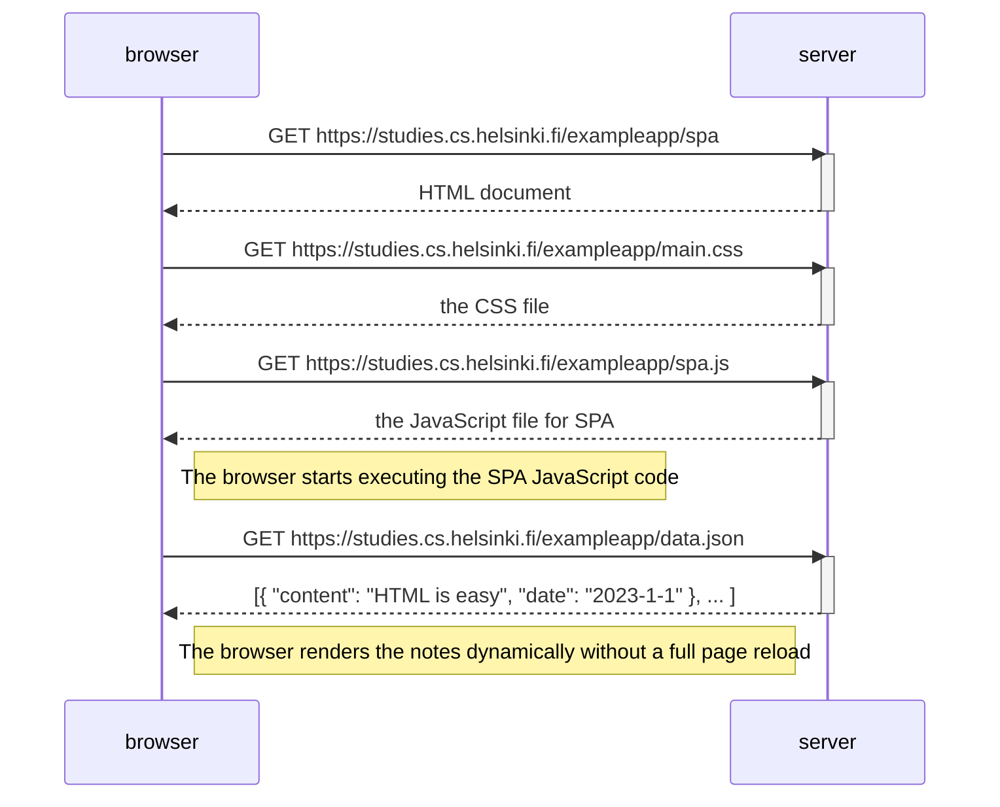

### 3. **0.5 Single-Page App Diagram Submission**

In `0.5_spa_diagram.md`, write the following:

````markdown
# 0.5: Single-Page App Diagram

This diagram shows the sequence of events when the user goes to the single-page app (SPA) version of the notes app.


````
