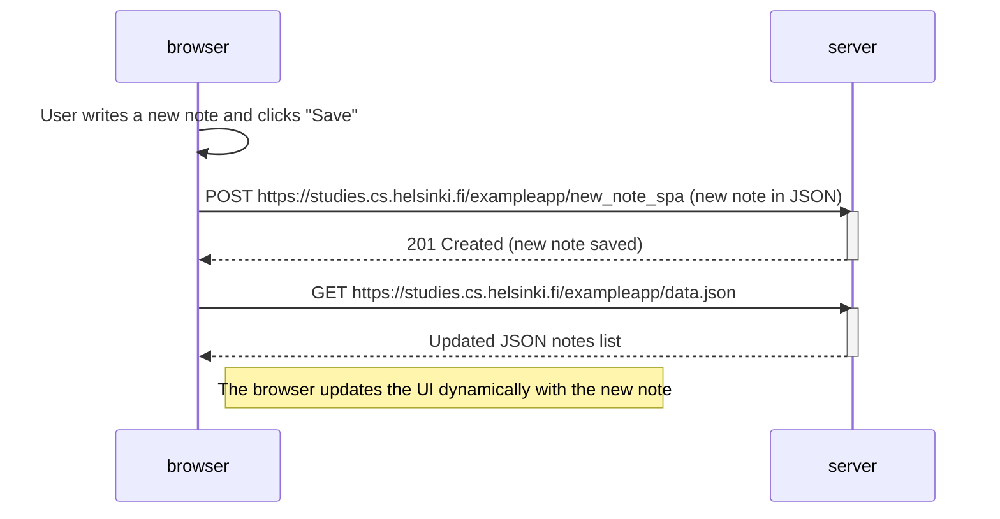

### 4. **0.6 New Note in Single-Page App Diagram Submission**

In `0.6_new_note_spa_diagram.md`, write the following:

````markdown
# 0.6: New Note in Single-Page App Diagram

This diagram represents the process of creating a new note using the single-page app (SPA) version of the notes app.


````
